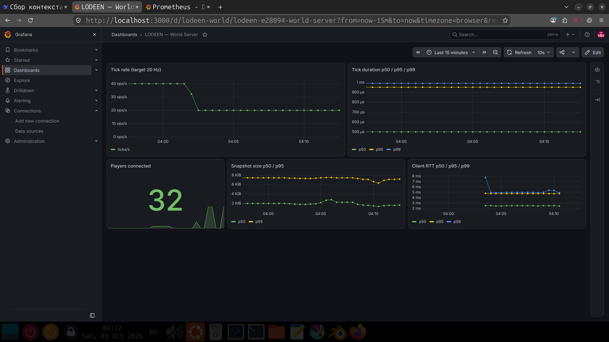
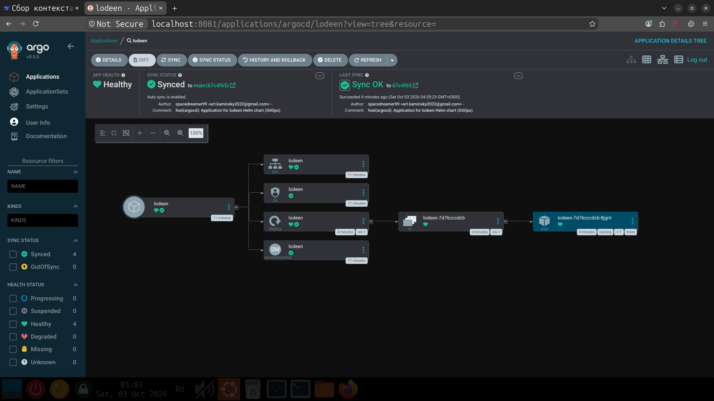

# LODEEN

📄 **[DevOps Portfolio](docs/PORTFOLIO.md)** | **Федеративная платформа для кооперативного мультиплеера на Go.**

PvE-фокус. Open Source (Apache 2.0). Chain of Trust. Opt-in discovery.

## Концепция

Платформа состоит из **двух компонентов**:

- **Launcher** (десктоп) — библиотека клиентов, автообновление, разрешение зависимостей, каталог миров.
- **Server** (облако) — инстанс: каталог миров, верификация, репутация, federation.

Всё остальное инкапсулировано внутри этих двух:

- **World** (игровой мир) — TCP, 20 Гц, живёт внутри Server.
- **Client** (3D-клиент) — управляется Launcher'ом; игрок его не видит.
- **CLI** — интерфейс управления Server; работает и на сервере, и на десктопе.

Множество независимых Server синхронизируются через **Chain of Trust** — ручную верификацию без автоматического наследования.

## Что видит игрок

**Только миры.** Не клиенты, не зависимости, не версии.

    ┌─────────────────────────────────────┐
    │  Survival EU    4.7    42/64        │
    │  Creative RU    4.5    12/32        │
    │  Adventure Map  4.2     8/16        │
    └─────────────────────────────────────┘

Launcher сам решает: какой клиент скачать, какие зависимости поставить, что обновить.

## Что видит владелец Server

**Свои миры, свои правила, свою модерацию.** Но в единой экосистеме.

- Несколько миров на одном Server.
- Свои верификации (кого принимать в федерацию).
- Своя команда модерации.
- Свой домен, свой бренд.

## Observability

- Prometheus + Grafana + Alertmanager в k3d (kube-prometheus-stack через Helm)
- ServiceMonitor → скрейпит `/metrics` каждого пода LODEEN каждые 15 с
- Дашборд: `monitoring/grafana/dashboards/lodeen.json`

### Метрики

| Метрика | Тип | Что показывает |
|---|---|---|
| `lodeen_tick_duration_seconds` | histogram | Время тика (SLO: p99 < 5 мс) |
| `lodeen_snapshot_bytes` | histogram | Размер снапшота в байтах |
| `lodeen_rtt_seconds` | histogram | RTT клиента (репортит клиент) |
| `lodeen_server_players_connected` | gauge | Игроков онлайн |
| `lodeen_server_ticks_total` | counter | Всего тиков |

### SLO (проверено нагрузочным тестом)

| Метрика | Цель | Достигнуто (32 бота) |
|---|---|---|
| Tick duration p99 | < 5 мс | **1.0 мс** |
| Tick rate | 20 Hz | **20 Hz** |
| RTT p99 (loopback) | < 100 мс | **~5 мс** |
| Errors | 0 | **0** |

**Нагрузочный тест:** 32 headless-бота × 60 секунд → 655 snapshots/s,
3.9 MB/s, 0 ошибок. Генератор: `cmd/loadtest`.
Запуск: `make loadtest N=32 DURATION=60s`.

## Стек

| Слой | Технология |
|---|---|
| Язык | Go 1.22+ |
| 3D-клиент | raylib-go |
| World | Go + net (TCP) |
| Server | Go + net/http |
| БД | PostgreSQL + Redis |
| Хранилище | Yandex Object Storage (S3) |
| Крипто | Ed25519 + X25519 + AES-GCM |
| Контейнеры | Docker multi-stage — scratch |
| Оркестрация | k3d / k3s |
| IaC | Ansible + Terraform |
| CI/CD | GitHub Actions |
| Мониторинг | Prometheus + Grafana + Loki |
| ОС сервера | AlmaLinux (RHEL-совместимый) |

## Deploy

### Helm

Установка:

    helm install lodeen ./deploy/helm/lodeen -n lodeen --create-namespace -f deploy/helm/lodeen/values-dev.yaml

Prod-оверрайды:

    helm upgrade --install lodeen ./deploy/helm/lodeen -n lodeen -f deploy/helm/lodeen/values-prod.yaml

Чарт в deploy/helm/lodeen/. Параметризован через values-{dev,prod}.yaml: image, resources, probes, NetworkPolicy, PDB, ServiceMonitor.

Старые манифесты в deploy/k8s/ оставлены для справки. Используйте Helm.

## GitOps

Развёртывание через ArgoCD. Git — источник правды, кластер синхронизируется сам.

- Application: `deploy/argocd/application.yaml`
- Чарт: `deploy/helm/lodeen/`
- Sync policy: automated + prune + selfHeal
- Реакция на drift: ArgoCD пересоздаёт удалённые ресурсы

Установка:

    kubectl apply -f deploy/argocd/application.yaml

### Демонстрация selfHeal

    kubectl -n lodeen delete deployment lodeen
    sleep 15
    kubectl -n lodeen get deployment   # восстановлен ArgoCD

## Infrastructure as Code

Готовые скелеты для развёртывания на VPS. Запуск — когда появится сервер.

- **Terraform**: `deploy/terraform-clo/` (FirstVDS) и `deploy/terraform-yc/` (Yandex Cloud)
- **Ansible**: `deploy/ansible/` — playbook `bootstrap.yml` ставит k3s + ArgoCD + Application
- **Runbook**: `docs/DEPLOY.md` — пошагово от VPS до рабочего кластера

Когда VPS готов:

    cd deploy/terraform-clo
    terraform apply
    cd ../ansible && ansible-playbook playbooks/bootstrap.yml

Через 10 минут: k3s + ArgoCD + LODEEN задеплоены через GitOps.

## Принципы

**Безопасность** (из Linux):
Least privilege, defense in depth, fail-safe defaults, audit, separation of duties.

**Мультиплеер** (из Minecraft):
Opt-in регистрация, server list, whitelist, anti-cheat.

**Порядок** (из Factorio):
Детерминизм, модульность, горизонтальное масштабирование, прозрачность.

**Сообщество** (из KSP):
Моддинг через Launcher, легко начать — сложно освоить, культура помощи.

**Доверие — только ручное.**
Chain of Trust: каждый link — отдельный акт верификации. Репутация не наследуется автоматически.

**Репутация — по категориям, с распределением.**
Не одна звезда, а распределение по категориям (геймплей, стабильность, сообщество,
администрирование, моды, производительность). Для каждой категории показывается
не только средний балл, но и полное распределение оценок (сколько поставили 5, 4, 3, 2, 1)
и общее число голосов. Это делает противоречия видимыми, а среднее — честным.
Комментарии с модерацией. Противоречия между источниками не скрываются.

**Discovery — только opt-in.**
`.well-known`, DNS SRV, federation crawl. Никакого active scan.

**Жанр — PvE.**
Осознанный выбор: меньше читеров, меньше токсичности, проще модерация, спокойная аудитория.

**Один процесс — один мир.**
Каждый мир — отдельный stateful-процесс с собственным состоянием. Никакого шардинга внутри мира: детерминизм важнее масштаба. Масштабирование — горизонтально по мирам.

## Структура

    cmd/
      launcher/     — Launcher (десктоп)
      server/       — Server (облако)
      world/        — игровой мир (внутри Server)
      client/       — 3D-клиент (управляется Launcher'ом)
      cli/          — CLI (сервер + десктоп)

    internal/
      launcher/     — логика Launcher (clients, updater, deps)
      server/       — логика Server (worlds, trust, reputation)
      world/        — логика игрового мира
      client/       — логика клиента
      cli/          — логика CLI
      shared/       — protocol, models, version, crypto

    assets/         — 3D-модели, шейдеры, шрифты
    migrations/     — SQL-миграции
    deploy/         — Docker, Ansible, K8s, Helm, Nginx
    monitoring/     — Prometheus, Grafana, Loki
    docs/           — документация

## Статус

- [x] Go-сервер (TCP, 20 Гц, metrics, admin HTTP)
- [x] Go-клиент (raylib, 6DOF, меню, чат, интерполяция)
- [x] Docker (multi-stage, scratch, ~4.5 МБ)
- [x] docker-compose (PostgreSQL + Redis)
- [x] CI (GitHub Actions: lint, test, build, docker, trivy)
- [x] Образ в GHCR (публичный)
- [x] k3d кластер + базовый деплой
- [x] Helm-чарт
- [x] ArgoCD (CD) — GitOps
- [x] Prometheus + Grafana + дашборд
- [~] Terraform + Ansible (скелеты готовы, ждём VPS)

## Лицензия

Apache License 2.0 — см. [LICENSE](LICENSE).

---

> **Status: paused.** Development frozen for diploma focus. Will resume after graduation. Architecture and code are stable at tag `v0.1-frozen`.
